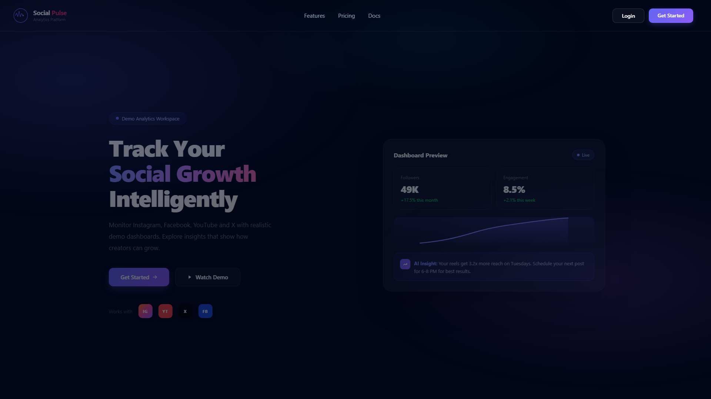
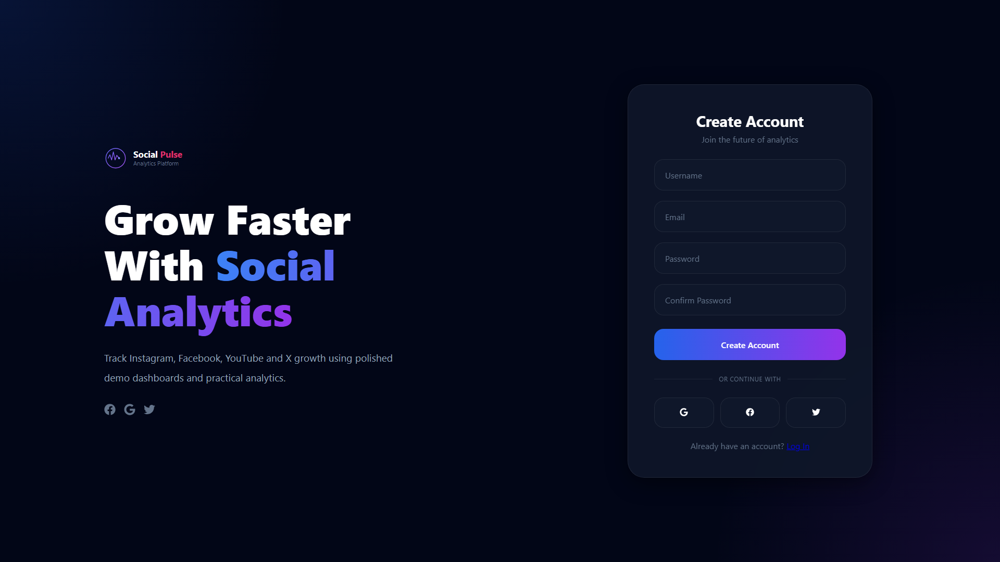
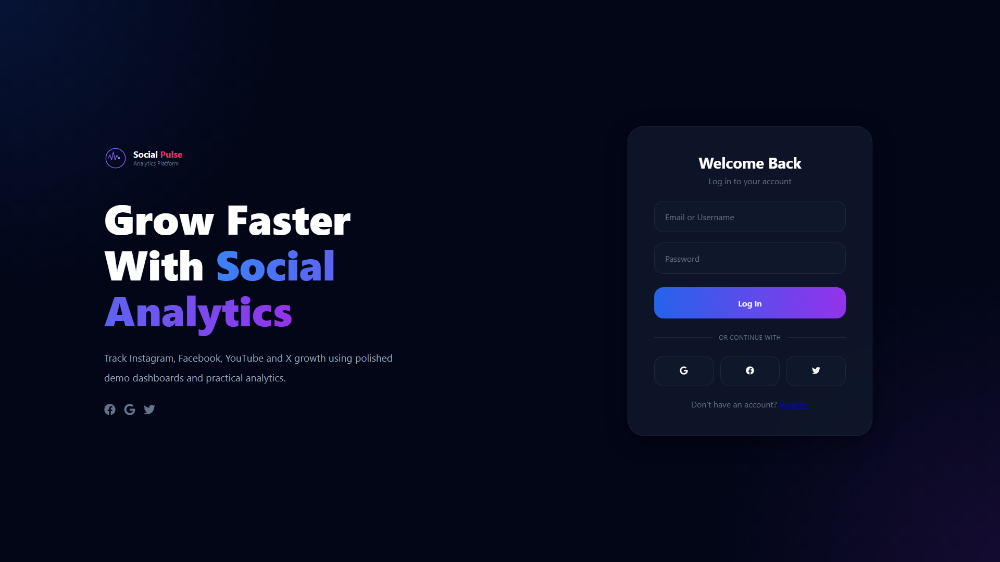
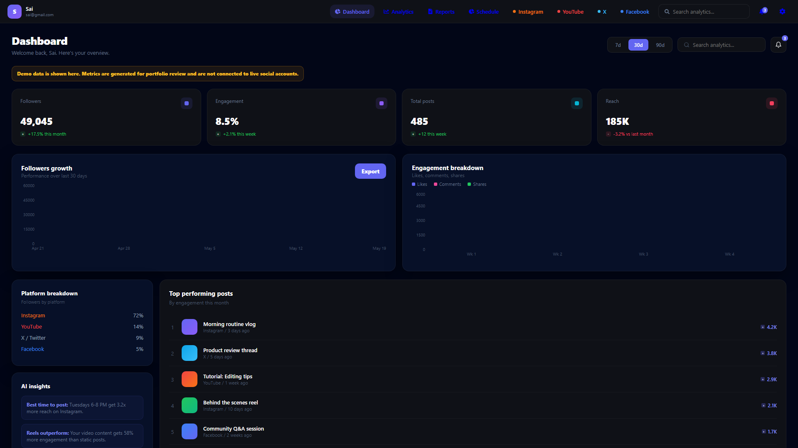
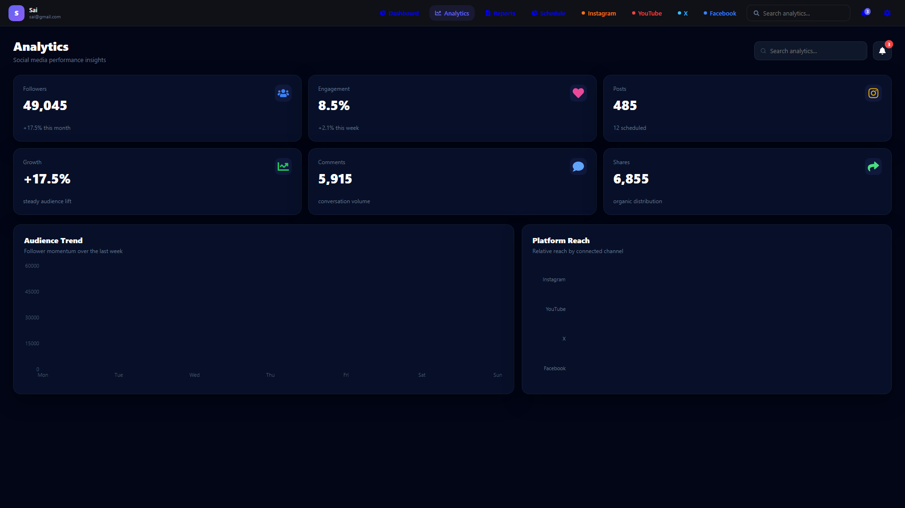
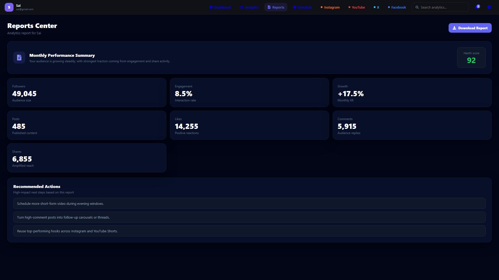
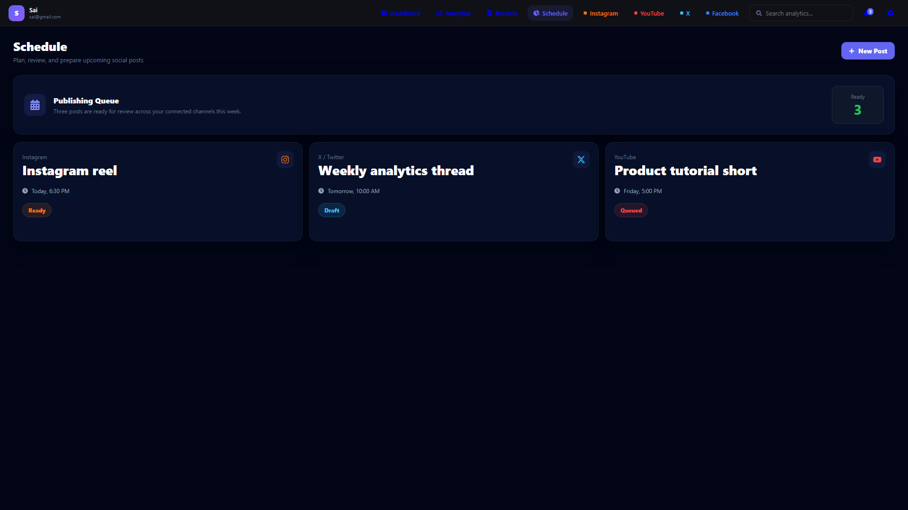

# Social Pulse - Social Media Analytics Platform

Social Pulse is a full-stack social media analytics dashboard built for portfolio review. It presents a polished analytics workspace for Instagram, Facebook, YouTube, and X, with authentication, protected app pages, chart-based insights, reports, and a publishing schedule.

The project uses deterministic demo data so recruiters can review the product experience immediately without OAuth setup, social media API keys, or paid platform access.




## Why This Project Stands Out

- Full-stack React and Django REST application with protected routes and JWT-based authentication.
- Recruiter-friendly demo mode with realistic analytics, charts, reports, and scheduled posts.
- Clean responsive UI designed like a modern SaaS analytics product.
- Reusable frontend architecture with route-level pages, layout components, context providers, and API services.
- Backend ownership protection for user-scoped social account data.
- Quality workflow with frontend linting/tests, backend tests, build checks, and GitHub Actions CI.

## Product Walkthrough

### Landing Page

The first screen introduces the product clearly, shows the supported social platforms, and previews dashboard metrics before the user signs in.


### Authentication

The auth flow includes a polished register page, login page, branded layout, social sign-in style buttons, and clear navigation between account states.

| Create Account | Login |
| --- | --- |
|  |  |

### Dashboard

The dashboard gives reviewers an immediate snapshot of core business metrics: followers, engagement, total posts, reach, growth trends, and engagement breakdowns.



### Analytics

The analytics page expands the KPI view with follower momentum, engagement, post volume, comments, shares, growth, and platform reach comparisons.



### Reports

The reports center summarizes monthly performance in a recruiter-readable format with a health score, export action, and metric cards for audience, content, reactions, replies, and shares.



### Schedule

The schedule view demonstrates product thinking beyond charts: upcoming posts, platform labels, content status, and a publishing queue for creators or marketing teams.



## Feature Summary

| Area | What It Shows |
| --- | --- |
| Authentication | Register, login, token storage, protected app routes |
| Dashboard | KPI cards, growth chart, engagement breakdown, demo-data banner |
| Analytics | Multi-platform performance insights and comparison charts |
| Reports | Monthly summary, health score, export-ready report layout |
| Schedule | Upcoming social posts with platform and status tracking |
| UI/UX | Responsive SaaS-style interface, icons, search, filters, navigation |
| Backend | Django REST Framework APIs, JWT auth, user-scoped data access |
| Testing | Frontend tests, backend tests, linting, CI workflow |

## Tech Stack

| Layer | Technology |
| --- | --- |
| Frontend | React 19, Vite 8, React Router 7, Recharts, React Icons |
| Backend | Django 5, Django REST Framework, SimpleJWT |
| Database | SQLite locally, PostgreSQL-ready for production |
| Styling | CSS custom properties, responsive layouts, theme tokens |
| Testing | Vitest, React Testing Library, Django TestCase |
| Deployment | Gunicorn, WhiteNoise, production environment variables |
| CI | GitHub Actions |

## Project Structure

```text
Social-media-analytics/
|-- backend/
|   |-- accounts/          # Authentication and user profile API
|   |-- analytics_app/     # Social accounts and analytics API
|   |-- core/              # Django settings, ASGI, WSGI, root URLs
|   |-- tests/             # Backend tests
|   |-- requirements.txt
|-- frontend/
|   |-- src/
|   |   |-- components/    # Reusable UI components
|   |   |-- context/       # Theme and notification providers
|   |   |-- layouts/       # Authenticated app shell
|   |   |-- pages/         # Route-level screens
|   |   |-- services/      # API client
|   |   |-- utils/         # Auth helpers, validation, demo data
|   |-- package.json
|   |-- vite.config.ts
|-- docs/
|   |-- screenshots/       # README screenshots
|   |-- capture-screenshots.mjs
|-- .github/workflows/ci.yml
|-- DEPLOYMENT.md
|-- README.md
```

## Getting Started

### Prerequisites

- Node.js 22 or newer
- Python 3.10 or newer
- pip and venv

### Backend Setup

```bash
cd backend
python -m venv venv
venv\Scripts\activate
pip install -r requirements.txt
copy .env.example .env
python manage.py migrate
python manage.py runserver
```

Backend API: `http://127.0.0.1:8000/api/`

### Frontend Setup

```bash
cd frontend
npm install
copy .env.example .env
npm run dev
```

Frontend app: `http://localhost:5173`

## Environment Variables

### Backend: `backend/.env`

| Variable | Purpose | Local default |
| --- | --- | --- |
| `DJANGO_SECRET_KEY` | Django secret key | Development key in `.env.example` |
| `DJANGO_DEBUG` | Enables development mode | `True` |
| `DJANGO_ALLOWED_HOSTS` | Comma-separated backend hosts | `localhost,127.0.0.1` |
| `DJANGO_CORS_ALLOWED_ORIGINS` | Allowed frontend origins | `http://localhost:5173,http://localhost:5174` |
| `DJANGO_CSRF_TRUSTED_ORIGINS` | Trusted HTTPS frontend origins | Empty locally |
| `DATABASE_URL` | Production PostgreSQL URL | Empty locally, falls back to SQLite |
| `SECURE_SSL_REDIRECT` | Redirects HTTP to HTTPS in production | `True` when debug is false |

### Frontend: `frontend/.env`

| Variable | Purpose | Local default |
| --- | --- | --- |
| `VITE_API_URL` | Backend API base URL | `http://127.0.0.1:8000/api/` |
| `VITE_GA_MEASUREMENT_ID` | Optional Google Analytics measurement ID for live visitor tracking | Empty |

## Quality Commands

```bash
# Frontend
cd frontend
npm run lint
npm test
npm run build

# Backend
cd backend
python manage.py check
python manage.py test
```

## Refresh README Screenshots

Start the frontend first, then run the screenshot capture script from the project root:

```bash
cd frontend
npm run dev -- --host 127.0.0.1

# In another terminal from the project root
node docs/capture-screenshots.mjs
```

The script saves updated images into `docs/screenshots/`.

## Deployment

See [DEPLOYMENT.md](DEPLOYMENT.md) for production environment variables and hosting guidance.

Recommended portfolio deployment:

- Frontend: Vercel or Netlify
- Backend: Render, Railway, Fly.io, or another Python host
- Database: SQLite for local development, PostgreSQL for production
- Backend start command: `gunicorn core.wsgi:application --bind 0.0.0.0:$PORT`
- Frontend build variable: `VITE_API_URL=https://your-backend-domain.com/api/`
- Optional tracking variable: `VITE_GA_MEASUREMENT_ID=G-XXXXXXXXXX`

## Portfolio Notes

Social Pulse intentionally uses generated demo analytics instead of live social platform APIs. This makes the project easy to run and review while still demonstrating practical full-stack engineering skills.

The dashboard includes a visible demo-data banner so reviewers understand the metrics are generated for portfolio review. After login, the app can present ready-to-review analytics immediately instead of requiring external social account connections.

## Roadmap

- Replace demo data with OAuth-based social integrations.
- Add Docker Compose for one-command local setup.
- Add Playwright end-to-end tests.
- Add role-based access and team workspaces.
- Add pagination and filtering for larger analytics datasets.

## License

MIT
